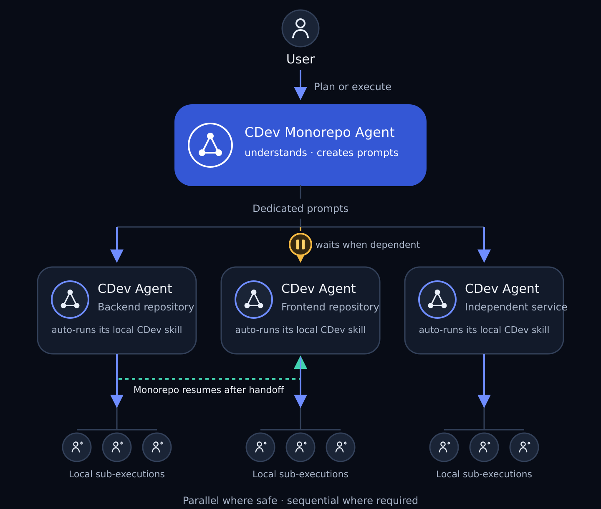

<div align="center">

<picture>
  <source media="(prefers-color-scheme: dark)" srcset="assets/wordmark-dark.svg">
  
</picture>

**Continuous Development Framework for Coding Agents**

*Coding agents work in sessions. CDev turns those sessions into continuous development.*

[](https://github.com/elmayii/cdev/releases)
[](LICENSE)
[](docs/08-installation.md)
[](https://github.com/elmayii/cdev/issues/new?template=field-report.yml)

</div>

---

## Why CDev?

Every coding-agent user knows these four failures:

- **The agent stops** when the assigned task ends — nothing happens while you are away.
- **The session dies** — context exhausted, quota wall, window closed — and everything it
  understood dies with it.
- **The plan drifts** away from what the repository actually contains.
- **"Done" without proof** — a claim nobody can verify later, silently poisoning everything
  built on top of it.

They are one problem: the agent's state lives in the conversation, and conversations are not
durable, not shared, and not verifiable.

> **CDev moves planning, state and evidence out of the conversation and into the repository.**

The plan lives in `SPRINTS.md`, the handoff in `AGENT_PROGRESS.md`, the truth in git. Any
session — new, resumed, or a different agent entirely — reads those and continues. Nothing is
"remembered"; everything is read.

## The loop

```text
Condition ──► Plan ──► Execute ──► Verify ──► Record ──► Continue ──╮
    ▲                                                               │
    ╰── stop only when a real human decision is required ◄──────────╯
```

Autonomy is explicit and bounded: a **clarity map** marks which parts of the product are
actually specified — the agent self-selects work only there, and inventing unspecified product
is forbidden. Anything irreversible (pushing shared branches, schema on shared databases,
deploys, payments) is **prepared, never executed**.

## Quick start

```text
/plugin marketplace add elmayii/cdev-marketplace
/plugin install cdev@cdev-marketplace
```

Then, in any repository:

```text
/cdev:bootstrap     # condition it (one human gate)
/cdev:cdev          # let it work
```

Ten-minute worked example: [the walkthrough](docs/community/walkthrough.md).

## Commands

| Command | Purpose |
|---|---|
| `/cdev:bootstrap` | Prepare one repository for CDev |
| `/cdev:cdev-planner` | Turn an objective into executable work, or analyze gaps |
| `/cdev:cdev` | Run continuous development in a conditioned repository |
| `/cdev:ockham` | Re-explain dense technical output in plain language |
| `/cdev:bootstrap-monorepo` | Prepare a workspace coordinating several repositories |
| `/cdev:cdev-monorepo-planner` | Plan and analyze work across repositories |
| `/cdev:cdev-monorepo` | Execute coordinated work across conditioned repositories |

## Which command, when?

| Where you are | What to run |
|---|---|
| A repository, not yet prepared for autonomous work | `/cdev:bootstrap` |
| You know the objective; the work is not structured yet | `/cdev:cdev-planner` |
| The plan has executable work | `/cdev:cdev` — it works batch after batch |
| The plan ran out | The loop derives next work itself — only inside what your docs specify |
| Something needs *you* | It stops only for real blockers, and names the exact decision |
| The product spans several repositories | The `*-monorepo` commands — coordination that never takes a repo's autonomy away |
| You didn't understand its output | `/cdev:ockham` |

## Microservices and multi-repo products

When one product spans several repositories — an API, its clients, independent services — CDev
adds a coordination layer that **composes** each repository's autonomy instead of absorbing it:

<div align="center">

</div>

The monorepo agent turns a system objective into **dedicated prompts** for each affected
repository's own CDev loop. Where one service depends on another, it **waits** for the
producer's published handoff and **resumes** the consumer with the real contract — never an
invented one. Independent repositories run **in parallel; work inside each stays sequential**,
because the local plan owns its order. Repositories the change doesn't touch are never opened.

```text
/cdev:bootstrap-monorepo        # condition the workspace over your repos
/cdev:cdev-monorepo-planner     # system objective → real batches in each repo
/cdev:cdev-monorepo             # execute, coordinate, verify end to end
```

The full mechanism, with a backend → frontend worked example:
[09 · CDev Monorepo](docs/09-cdev-monorepo.md).

## Method, not just a plugin

> **CDev is the method. The current reference implementation is a Claude Code plugin.**

Designed as a coding-agent-independent method; currently shipped as a Claude Code plugin —
the first host binding. The portability claim is unvalidated and labeled as such.

I tried spec-driven development. It wasn't how I wanted coding agents to work, so I built a
different method. Spec-driven makes the specification drive implementation; **continuous
development makes the repository able to sustain development across sessions** — different
objectives, both legitimate.

## Evidence, not theory

CDev was extracted from six weeks of driving a real, in-production product — then hardened by
running the method on this repository itself (its own `docs/develop/` is a live CDev instance).

| | |
|---|---|
| Repositories driven | 4, all different in kind, plus an orchestrating workspace |
| Local sprints executed | ~27, across 5 CDev instances |
| Handoff entries written | 178 |
| Longest coordination layer run | 9 days, 27 system batches, 7 cross-repo contracts |

| # | Document | Question it answers |
|---|---|---|
| [01](docs/01-origin.md) | Origin | What pain this came from, and why earlier attempts were abandoned |
| [02](docs/02-model.md) | Model | The ideas the whole method rests on |
| [03](docs/03-mechanics.md) | Mechanics | Artifacts, loop, states, resumption |
| [04](docs/04-skills.md) | Skills | What each piece is for |
| [05](docs/05-field-report-repo.md) | Field report — single repo | Four real repositories: what held and what broke |
| [06](docs/06-field-report-system.md) | Field report — multi-repo | Four repos as one system: what held and what broke |
| [07](docs/07-core-vs-periphery.md) | Core and periphery | What *is* CDev, derived from evidence, not taste |
| [08](docs/08-installation.md) | Installation | What actually installs, and what deliberately does not |
| [09](docs/09-cdev-monorepo.md) | CDev Monorepo | How one workspace coordinates several autonomous repositories |
| [10](docs/10-usage-recommendations.md) | Usage recommendations | Model and effort defaults for the current Claude Code binding |

The field reports document failures as carefully as successes — that honesty is the method.

## Community

- **[Field reports](https://github.com/elmayii/cdev/issues/new?template=field-report.yml)** —
  the contribution we value most: run CDev on real work and tell us what held and what broke.
  No code required.
- **[Discussions](https://github.com/elmayii/cdev/discussions)** — questions, ideas, RFCs.
  *Discussion = conversation, issue = actionable work.*
- **[Contributing](CONTRIBUTING.md)** — the core changes on field evidence, never on taste;
  profiles and host bindings are the natural extension points
  ([RFC process](docs/community/rfc-process.md)).

## License

[MIT](LICENSE) · This repository runs on its own method — the live plan, handoff and decisions
are public in [`docs/develop/`](docs/develop/).
